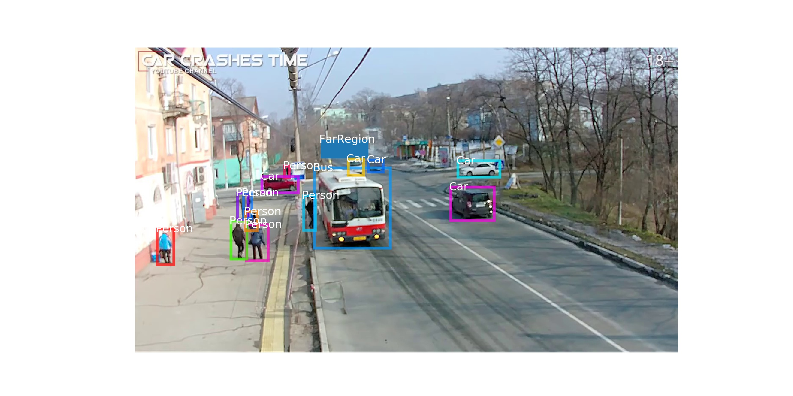

# Car Crash forecasting and detection

1. The tools for initial investigations: https://github.com/mental689/django-survey

2. The tool for temporal annotations: https://github.com/antingshen/BeaverDam

3. The tool for spatio-temporal annotations: https://github.com/jldowns/vatic-docker-contrib

